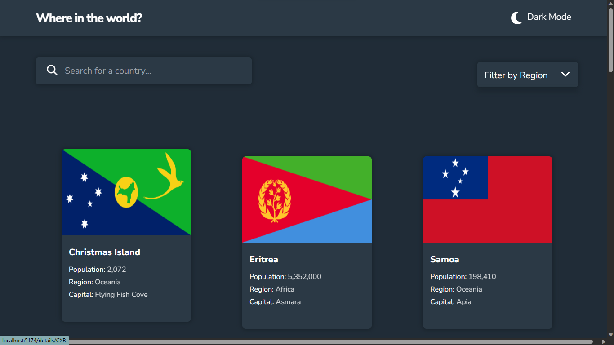

# REST Countries API App

## About

This app fetches and displays data from the REST Countries API. You can:
- Filter between regions
- Search for countries
- Toggle light and dark modes
- View border countries from the detail page(click on the country cards)
- View the country's location on the map

## Technologies used

React and Tailwind

### Screenshot

### Links

- Live Site URL: [https://feng-restcountries.netlify.app](https://feng-restcountries.netlify.app)

### Built with
 
- Vite
- Mobile-first workflow
